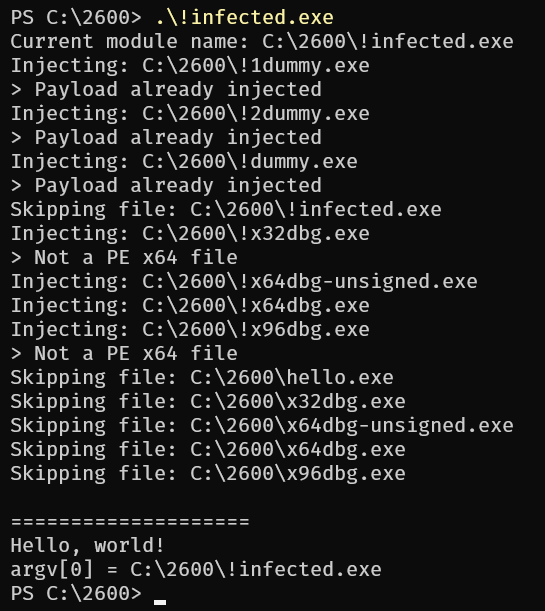

# Virologie &amp; Malware - Projet Yharnam - École 2600 <!-- omit in toc -->

> *“Wretched outsider! Tryin’ to fool me to open this door?”*

***

- [Objectif](#objectif)
- [Fonctionnalités](#fonctionnalités)
- [Limitations](#limitations)
- [Compilation](#compilation)
  - [Prérequis](#prérequis)
  - [Compilation](#compilation-1)
  - [Cibles Makefile](#cibles-makefile)
    - [Cibles principales (.exe)](#cibles-principales-exe)
    - [Cibles “phony”](#cibles-phony)
  - [Flags de compilation](#flags-de-compilation)
  - [Exemples](#exemples)
- [Comportement du malware](#comportement-du-malware)
  - [Payload](#payload)
    - [Structure](#structure)
    - [Logging](#logging)
  - [Injection](#injection)
  - [Mesures de protection](#mesures-de-protection)
    - [Obfuscation](#obfuscation)
    - [Chiffrement AES](#chiffrement-aes)
    - [Anti-debug](#anti-debug)

## Objectif

Le but principal de ce projet était de créer un programme permettant d'injecter un code malveillant dans un exécutable Windows (fichier PE x64). Pour nos besoins, le payload injecté est une simple MessageBox.

## Fonctionnalités

En plus de la simple injection de code, notre projet dispose des fonctionnalités suivantes :

- Obfuscation automatique (à la compilation) des chaînes de caractères utilisées par le malware, de manière à ce qu'elles ne soient pas directement visibles dans le code
- Chiffrement du payload en AES-128-CBC
  - Insertion d'un *stub* avant le payload pour le déchiffrer à l'exécution
- Infection de tous les fichiers .exe du répertoire courant
  - Filtrage de ceux qui ne sont pas des PE x64
  - Détection si un exécutable est déjà infecté, pour éviter une seconde infection, grâce à une signature placée au début du payload
  - Le malware évite aussi de s'infecter lui-même
- Détection des environnements de debug, pour compliquer l'analyse

Des flags de compilation permettent de changer le comportement du malware :

- Activer le mode debug (affiche des informations supplémentaires à l'exécution du payload)
- Limiter l'infection aux fichiers dont le nom commence par “`!`”, pour éviter d'infecter des exécutables importants par erreur
- Désactiver la vérification de l'infection, pour tester le malware sur un fichier déjà infecté
- Désactiver l'anti-debug, pour faciliter le développement
- Désactiver le chiffrement AES
  - Choix possible de la clé et du vecteur d'initialisation (IV), en ASCII ou en hexadécimal

Une attention particulière a été portée à la taille du payload, pour qu'elle soit la plus petite possible, grâce à de nombreux tests sur le code C++, et des options de compilation privilégiant une taille de code minimale (`/O2`, `/Ob3`, `/GS-`, `/Os`, `/Oi`, `/Zl`).

## Limitations

Le malware ne fonctionne que sur des fichiers .exe 64 bits (PE32+) qui ne vérifient pas leur intégrité (par exemple, les exécutables du système Windows ne peuvent pas être infectés, car ils crashent à l'exécution lors du chargement par le loader PE, avant même que le point d'entrée soit atteint).

## Compilation

Le projet utilise un Makefile et est compilé avec `nmake`, qui est inclus dans Visual Studio Build Tools.

### Prérequis

La compilation du projet a été testée avec les outils suivants :

- Développement desktop en C++ de Microsoft Visual Studio 2022
  - MSVC v143
  - Windows SDK 10.0.22621.0

### Compilation

Pour compiler le projet, il faut tout d'abord ouvrir une console *x64 Native Tools Command Prompt for VS 2022*. Ensuite, il suffit de se rendre dans le répertoire du projet et de lancer la commande suivante :

```powershell
nmake
```

Cela va créer un programme `inject.exe`, qui permet d'injecter le malware dans le .exe passé en argument.

### Cibles Makefile

#### Cibles principales (.exe)

- `inject` : Compile l'injecteur (`inject.exe`)
- `payload` : Compile un programme de test (`payload.exe`) pour lancer directement le payload en mode non-injecté, avec un mode debug activé (trace les appels à `GetDll`/`GetFunc`)
- `readpe` : Compile un programme (`readpe.exe`) pour afficher les informations d'un fichier PE
- `hello` : Compile un simple programme Hello World (`hello.exe`) pour tester l'infection

#### Cibles “phony”

- `all` : Compile l'injecteur (cible par défaut) [alias de `inject`]
- `clean` : Supprime les fichiers de compilation (.obj, .pdb, .ilk)
- `fclean` : Supprime les fichiers de compilation et les .exe [dépend de `clean`]
- `dummy` : Compile `hello.exe` et le copie plusieurs fois (`dummy.exe`, `!dummy.exe`, `!1dummy.exe`, `!2dummy.exe`) pour tester l'infection sur plusieurs fichiers [dépend de `hello`]
- `run` : Compile l'injecteur et le lance sur `dummy.exe` [dépend de `inject`, `dummy`]
- `run_payload` : Compile `payload.exe` et le lance [dépend de `payload`, `dummy`]
- `run_readpe` : Compile l'injecteur et le lance sur `dummy.exe`, puis compile `readpe.exe` et le lance sur le `dummy.exe` infecté [dépend de `run`, `readpe`]
- `check` : Compile l'injecteur et le lance sur `dummy.exe`, puis exécute `dummy.exe` pour vérifier que le malware fonctionne correctement [dépend de `run`]

### Flags de compilation

Les flags de compilation disponibles sont :

- `PL_DEBUG=1` : Active le mode debug du payload (affiche les fichiers en cours d'infection)
- `NEED_BANG=1` : Limite l'infection aux fichiers dont le nom commence par “`!`”
- `SKIP_SIGN=1` : Désactive la vérification de l'infection (permet les infections multiples)
- `NO_ANTIDBG=1` : Désactive l'anti-debug
- `NO_ENCRYPT=1` : Désactive le chiffrement AES
- `VERBOSE=1` : Passe le flag `-v` (verbose) à l'injecteur

Il est possible de les combiner pour activer plusieurs options en même temps, et de noter `=0` pour désactiver un flag (comme s'il n'était pas défini).

Si le chiffrement est activé, il est possible de définir les paramètres suivants :

- `AES_KEY=...` : Clé de chiffrement AES, en ASCII (16 caractères)
- `AES_IV=...` : Vecteur d'initialisation (IV), en ASCII (16 caractères)
- `AES_KEY_HEX=...` : Clé de chiffrement AES, en hexadécimal (32 caractères)
- `AES_IV_HEX=...` : Vecteur d'initialisation (IV), en hexadécimal (32 caractères)

Il n'est pas possible de définir à la fois `AES_KEY` et `AES_KEY_HEX`, ou `AES_IV` et `AES_IV_HEX`.

En cas d'absence de clé ou d'IV, des valeurs par défaut sont utilisées :

- Clé : `sUp3rDuP3rS3cr3T`
- IV : `r4Nd0MiVR4nD0mIv`

### Exemples

- Compiler l'injecteur, le lancer sur `dummy.exe` et exécuter `dummy.exe`, avec le mode debug du payload et la limitation aux fichiers commençant par “`!`”, la vérification de l'infection et l'anti-debug activés, mais le chiffrement AES désactivé :

  ```powershell
  nmake check PL_DEBUG=1 NEED_BANG=1 SKIP_SIGN=0 NO_ANTIDBG=0 NO_ENCRYPT=1
  ```

  Les exécutables suivants seront créés et potentiellement infectés :

  - `inject.exe` (pas infecté)
  - `hello.exe` (pas infecté)
  - `dummy.exe` (infecté en premier par `inject.exe`, ignoré par lui-même)
  - `!dummy.exe` (infecté par la suite par `dummy.exe`)
  - `!1dummy.exe` (infecté par la suite par `dummy.exe`)
  - `!2dummy.exe` (infecté par la suite par `dummy.exe`)

- Compiler l'injecteur et `readpe.exe`, lancer l'injecteur sur `dummy.exe` et exécuter `readpe.exe` sur `dummy.exe` infecté, sans le mode debug du payload ni la limitation aux fichiers commençant par “`!`”, mais avec la vérification de l'infection et l'anti-debug activés :

  ```powershell
  nmake run_readpe
  ```

- Compiler l'injecteur en mode verbose, le lancer sur `dummy.exe` et exécuter `dummy.exe`, sans le mode debug du payload ni l'anti-debug, mais avec le chiffrement AES activé et une clé et un IV personnalisés :

  ```powershell
  nmake fclean check NEED_BANG=1 NO_ANTIDBG=1 VERBOSE=1 AES_KEY="Hello, AES world" AES_IV_HEX="0123456789abcDEF0123456789ABCdef"
  ```

## Comportement du malware

Le code malveillant (payload) est stocké dans une section à part (`injected`), avec ses variables statiques. Cela permet de facilement le rendre indépendant de sa position en mémoire, et de le copier pour l'infection.

### Payload

#### Structure

Le payload est composé de trois parties : deux *stubs* en assembleur, et le code malveillant en C++.
Le stub d'entrée (`payload_begin.asm`) est mis en premier, et se charge de mettre en place les adresses relatives et de créer la pile pour appeler le code C++. Une fois le code C++ terminé, il appelle le point d'entrée original du programme.
Le stub de sortie (`payload_end.asm`) contient simplement un symbole pour calculer la taille du payload.

> Note : comme les options passées à `cl.exe` visent une taille de code minimale, les fonctions compilées n'ont pas de prologue/épilogue, ce qui cause des problèmes à l'exécution, notamment quand une fonction en appelle une autre. Pour pallier ce problème, le *stub* d'entrée crée une pile de 4 ko avant d'appeler le code C++ (`enter 1000h, 0`), puis la nettoie à la sortie (`leave`).

Le code C++, une fois compilé en .obj, est placé en sandwich entre les deux *stubs*.

Il a deux fonctions : répandre le malware dans les autres exécutables du répertoire courant, et exécuter la charge malveillante.
Dans notre cas, les exécutables infectés affichent simplement une MessageBox avec le titre “`Yharnam`” et le message “`~ Fear the Old Blood ~`”.

#### Logging

Si le mode debug est activé (`PL_DEBUG=1`), le payload affiche des informations supplémentaires à l'exécution, notamment les fichiers en cours d'infection, et les erreurs rencontrées.

> Si le programme infecté ne possède pas de console, les messages de debug s'afficheront dans des MessageBox successives. Cela peut être gênant, mais permet de ne pas perdre les informations de debug.

Par exemple, voici le résultat de l'exécution d'un fichier infecté (`!infected.exe`) dans un répertoire contenant des exécutables, dont plusieurs sont déjà infectés, et d'autres sont des PE 32 bits.

On peut voir que le malware ignore les fichiers déjà infectés, et ne tente pas d'infecter les fichiers 32 bits. Il ne touche pas non plus à lui-même, ni aux fichiers dont le nom ne commence pas par “`!`” (`NEED_BANG=1`).



### Injection

Pour infecter un exécutable, l'injecteur ouvre d'abord le fichier en lecture pour vérifier s'il s'agit bien d'un PE 64 bits, et qu'il n'a pas déjà été infecté (grâce à la constante `0xBAADC0DE` placée au début du payload, juste avant son point d'entrée).

Ensuite, il rouvre le fichier en lecture/écriture pour injecter le payload à la fin de la dernière section.
Les valeurs de la taille du payload et de l'offset de son point d'entrée, ainsi que l'offset du point d'entrée original, sont définis dans les variables globales du payload. La dernière section est rendue exécutable et marquée comme contenant du code, et son flag `DISCARDABLE` est retiré pour éviter qu'elle soit déchargée par le loader.

Enfin, il modifie le point d'entrée (`AddressOfEntryPoint`) pour qu'il pointe sur le début du payload, et met à jour différents champs du header pour que le fichier reste valide (`VirtualSize`, `SizeOfRawData`, `SizeOfCode`, `SizeOfImage`).
La taille finale du fichier, ainsi que la nouvelle taille de la section infectée, sont alignées sur la valeur `FileAlignment` du header (généralement 512 octets), tandis que la valeur de `SizeOfImage` est alignée sur `SectionAlignment` (généralement 4096 octets, correspondant à la taille d'une page mémoire).

### Mesures de protection

#### Obfuscation

Tous les appels à des fonctions de l'API Win32 sont effectués de manière dynamique, en récupérant les adresses des DLL et fonctions à l'exécution. Cela permet d'être indépendant des adresses en mémoire, et de ne pas avoir de table d'imports suspecte.
Afin de limiter les chaînes de caractères dans le code, les noms des DLL et fonctions sont hashés, et les adresses sont récupérées à partir de ces hash à l'exécution.
Le hashing dans le code est effectué à la compilation (grâce à une *template* et au mot-clé `constexpr` de C++), de sorte que le code compilé ne contienne que des valeurs numériques pour les appels à l'API.

Les autres chaînes de caractères utilisées par le malware sont obfusquées, pour éviter qu'elles soient directement visibles avec des outils comme `strings`. Elles sont déchiffrées à l'exécution, et stockées dans des variables statiques dans la section `injected`.
Pour des raisons de simplicité, le chiffrement est basique : chaque caractère est XORé avec la valeur 0x42, puis ses bits sont décalés de 5 vers la gauche de façon circulaire (ROTL).

Le chiffrement est effectué à la compilation, grâce à des *templates* C++, des structures, et les mots-clés `constexpr` et `consteval`. Ainsi, le code compilé ne contient que les chaînes obfusquées.

#### Chiffrement AES

Le payload est séparé en deux parties : un *stub* de déchiffrement, qui est le point d'entrée appelé par l'assembleur (`inj_code_c()`), et le code malveillant qui est chiffré (`run_payload()`).

> Note : si le chiffrement est désactivé, le *stub* se contente d'appeler directement le code malveillant.

L'injecteur stocke la clé et le vecteur d'initialisation (IV) de manière obfusquée dans le payload, pour compliquer leur extraction.

Le *stub* de déchiffrement commence par récupérer les adresses des fonctions nécessaires à son fonctionnement (`VirtualProtect`, `LocalAlloc`, `LocalFree`), puis alloue de la mémoire pour stocker une copie du payload chiffré, qui servira plus tard pour infecter d'autres exécutables. Il rend ensuite la mémoire contenant le payload chiffré original accessible en écriture, puis le déchiffre en utilisant la clé et l'IV qu'il a désobfusqués. Enfin, il appelle le code malveillant déchiffré, en lui passant en argument l'adresse de la copie du payload chiffré.

> En effet, si le code malveillant se contentait de copier son propre code pour infecter d'autres fichiers, il copierait le payload *déchiffré*, ce qui veut dire que le nouvel exécutable infecté tenterait de déchiffrer un payload déjà déchiffré, ce qui ne fonctionnerait pas.
> Il est donc nécessaire de garder une copie du payload chiffré pour l'infection.

#### Anti-debug

Avant d'exécuter quoi que ce soit, le malware essaie de déterminer s'il est en train d'être debuggé. Pour cela, il utilise plusieurs valeurs présentes dans le *Process Environment Block* (PEB) :

- `BeingDebugged` : Indique si le processus est en train d'être debuggé, mais peut facilement être modifié par un debugger
- `NumberOfProcessors` : Nombre de processeurs logiques ; s'il est inférieur ou égal à 2, le processus est probablement en train d'être debuggé, ou exécuté dans une machine virtuelle
- `NtGlobalFlag` : Les debuggers définissent souvent les flags `FLG_HEAP_ENABLE_TAIL_CHECK` (0x10), `FLG_HEAP_ENABLE_FREE_CHECK` (0x20), et `FLG_HEAP_VALIDATE_PARAMETERS` (0x40), mais cela peut varier

Si le malware détecte qu'il est en train d'être debuggé, il ne fait rien et va directement au point d'entrée original du programme.
Il y a également la possibilité de faire crasher le programme, dans des lignes commentées du code au début de `payload.cpp` :

- `__debugbreak();` : Insère un `int 3` (0xCC) dans le code, qui est une instruction de breakpoint pour les debuggers
- `__fastfail(FAST_FAIL_FATAL_APP_EXIT);` : Provoque un arrêt brutal du programme (instruction `int 0x29`)
- `((PVOID(*)())NULL)();` : Appelle `NULL` comme une fonction, provoquant un segfault

> On pourrait aussi imaginer d'autres méthodes pour détecter un environnement de debug, comme la présence de certains processus ou drivers, ou la modification de certaines valeurs en mémoire.
> De plus, au lieu de ne rien faire ou de crasher, le payload pourrait induire en erreur le debugger, en adoptant un comportement différent.
